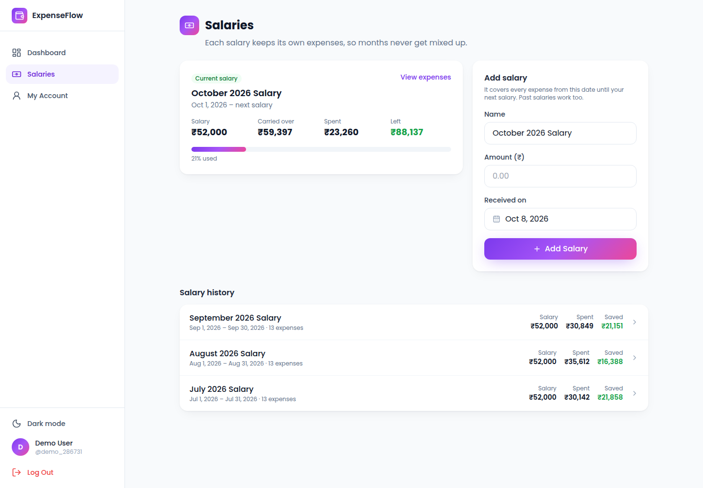
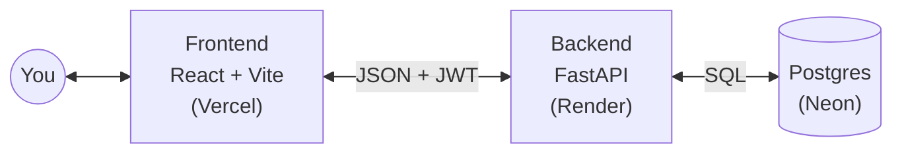

# ExpenseFlow

A small app I built to track my spending one salary at a time.



## Why I built it

I get paid once a month, and in a normal expense list every month blurs into one long list. I wanted each salary to be its own thing, so I can see what came in, what went out and what was left before the next one arrived.

## Features

- Start a new salary every payday. New expenses go into the current salary automatically.
- Finished salaries move to a history list showing the amount, how much was spent and how much was saved. Click one to see all of its expenses and a category breakdown.
- Add, edit and delete expenses, and move an expense to a different salary.
- Overview with a date range picker, spending by category, daily and monthly charts, and a few quick insights (top category, biggest expense, this month vs last).
- History table with search, category filter, sorting and CSV export.
- Accounts with username and password (bcrypt + JWT). Each user only sees their own data.
- Dark mode and saved defaults for category and payment method.

## Tech stack

- **Frontend:** React 18.3, Vite 5.4, Tailwind CSS 3.4, React Router 6, Recharts 3, plain JavaScript (.jsx)
- **Backend:** Python 3.12, FastAPI 0.141, Uvicorn, psycopg2, bcrypt, PyJWT
- **Database:** Postgres on Neon
- **Hosting:** Vercel (frontend), Render (backend), Neon (database)

## How it works

The React app runs in the browser and calls the FastAPI backend over HTTP with a JWT in the header. The backend checks the token, runs the query against Postgres on Neon and sends JSON back. Every row has a `user_id`, and expenses also have a `salary_id` that links them to the salary they came out of. The salary totals (spent, left) are worked out in SQL from the linked expenses.



## Run it locally

**Prerequisites:** Python 3.10+, Node 18+, and a Postgres database (a free Neon project works fine).

```bash
git clone https://github.com/saxenamayank-20/Expense_Flow.git
cd Expense_Flow
```

**Backend** (first terminal):

```bash
cd backend
python3 -m venv .venv
source .venv/bin/activate
pip install -r requirements.txt
cp .env.example .env
uvicorn main:app --reload --port 8000
```

Fill in `backend/.env`:

- `DATABASE_URL`
- `SECRET_KEY` (optional locally)
- `ALLOWED_ORIGINS` (optional locally)

Tables are created on first start.

**Frontend** (second terminal):

```bash
cd frontend
npm install
cp .env.example .env
npm run dev
```

`frontend/.env` has one variable, `VITE_API_URL`, which points at the backend (`http://localhost:8000` locally).

Open http://localhost:5173 and register an account.

Deploying to Vercel, Render and Neon is covered in [docs/deployment.md](docs/deployment.md).

## API routes

All routes except auth and `/api/meta` need a `Bearer` token.

| Method | Route | What it does |
| --- | --- | --- |
| GET | `/api/meta` | Categories and payment methods |
| POST | `/api/auth/register` | Create an account |
| POST | `/api/auth/login` | Log in, returns a token |
| POST | `/api/auth/forgot-password` | Reset password by username |
| GET | `/api/auth/me` | Current user |
| PUT | `/api/auth/password` | Change password |
| GET | `/api/expenses` | List my expenses |
| POST | `/api/expenses` | Add an expense (goes into the current salary) |
| PUT | `/api/expenses/{id}` | Edit an expense or move it to another salary |
| DELETE | `/api/expenses/{id}` | Delete an expense |
| GET | `/api/salaries` | List salaries with spent and expense count |
| POST | `/api/salaries` | Start a new salary (finishes the current one) |
| PUT | `/api/salaries/{id}` | Edit name, amount or date |
| POST | `/api/salaries/{id}/close` | Finish a salary |
| POST | `/api/salaries/{id}/reopen` | Reopen a finished salary |
| DELETE | `/api/salaries/{id}` | Delete a salary (its expenses are kept) |
| GET | `/api/account/stats` | Totals for the account page |
| DELETE | `/api/account` | Delete my account and all its data |

## Project structure

```
backend/     FastAPI app (main.py routes, db.py queries, auth.py)
frontend/    React + Vite app (pages, components, api.js)
docs/        deployment notes and screenshot
```

## Challenges / what I learned

- Opening a fresh connection to Neon on every query took seconds, so some requests were very slow. Switching to a small connection pool fixed it.
- Moving from SQLite to Postgres meant moving the old single-user data over, so the first account to register claims those rows.
- Getting salaries in without breaking old data: expenses got a nullable `salary_id`, so older expenses just stay unlinked until I move them.

## Known limitations and what's next

- Render's free plan sleeps, so the first load after a while is slow.
- Forgot password only asks for the username, so anyone who knows it can reset the password. This needs a proper check.
- No automated tests yet.
- Amounts are always shown in ₹.
